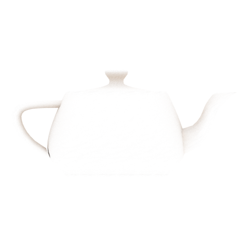
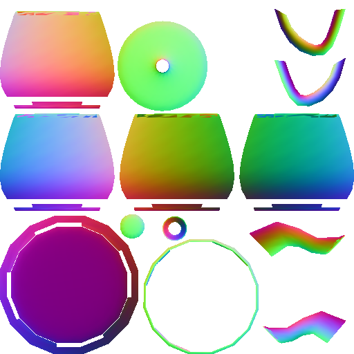
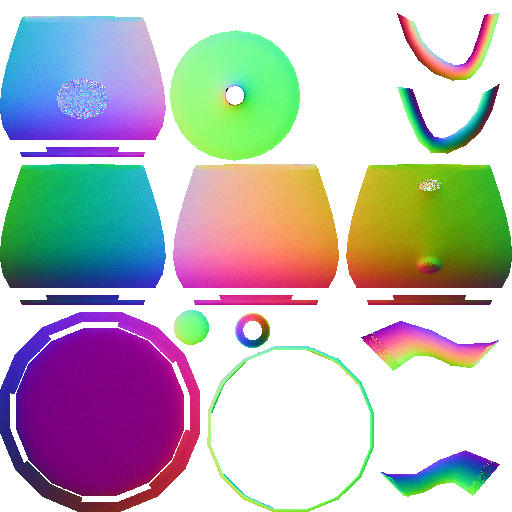
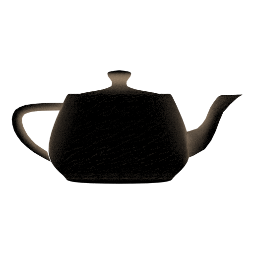
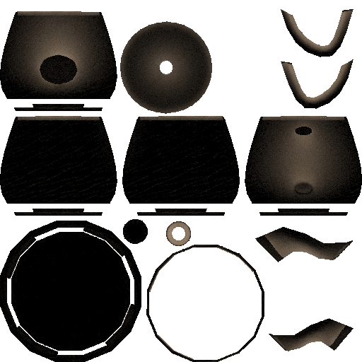
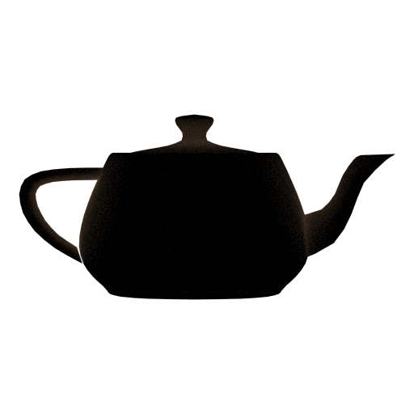
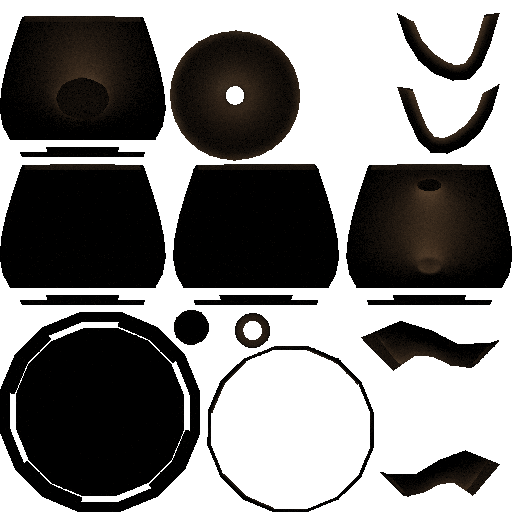
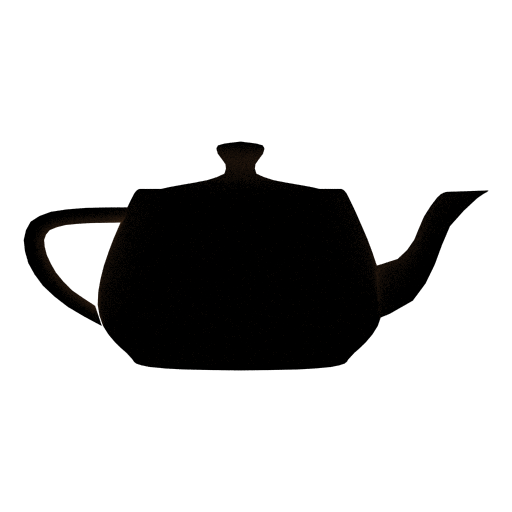
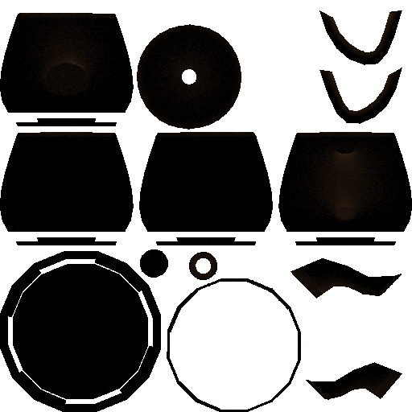

# PicoRender

*This code is Obsolete*. It was written by me around 2014, when I just started doing graphics.

Very simple raytracer for baking ambient occlusion and [bent normal](http://citeseerx.ist.psu.edu/viewdoc/download?doi=10.1.1.230.6374&rep=rep1&type=pdf). No dependencies.

Now, it does not have much of a value, but I did minor fixes/cleanup out of curiosity to dig some of my old code.

The main purpose was to produce ambient occlusion maps and [bent normal](http://citeseerx.ist.psu.edu/viewdoc/download?doi=10.1.1.230.6374&rep=rep1&type=pdf) maps.

|   |           Camera space   |           Texture space  |
:---|:------------------------:|:-------------------------:
Albido |   |  
Ambient Occlusion / Lightmap|   |  
Normals |   |  
Bent Normals (AO in alpha)|   |  
Composition |   |  

|   |           Camera space   |           Texture space  |
:---|:------------------------:|:-------------------------:
Total Ambient Occlusion / Lightmap|   |  
Bounce 1 |   |  
Bounce 2 |   |  
Bounce 3 |   |  
Bounce 4 |   |  
